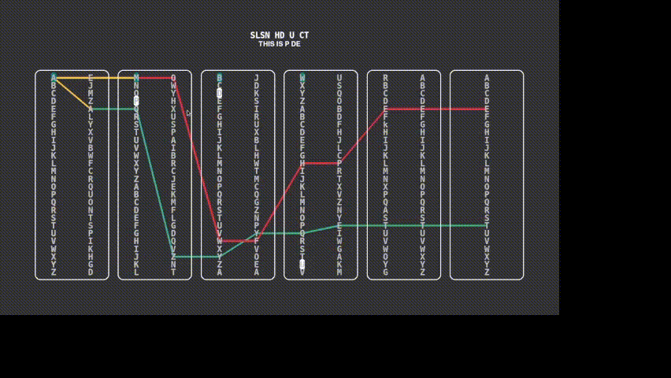

This is a simple simulation of the enigma machine, which is a famous machine used by the Germans during WWII to transmit encrypted messages.
It consists of a plugboard which maps a letter to a specific letter, or rotors (in our case only three) and finally a reflector. Each letter entered through the keyboard would pass into the plugboard, through the rotors it  would be reflected by the reflector and then pass again through the rotors. The result would be a letter which would be shown on a lampboard. After each keypress the rotos shift and this allows for the letters not to be the same and the encryption harder to crack.
n Enigma machine, the Germans' main military encryption tool during World War II.

